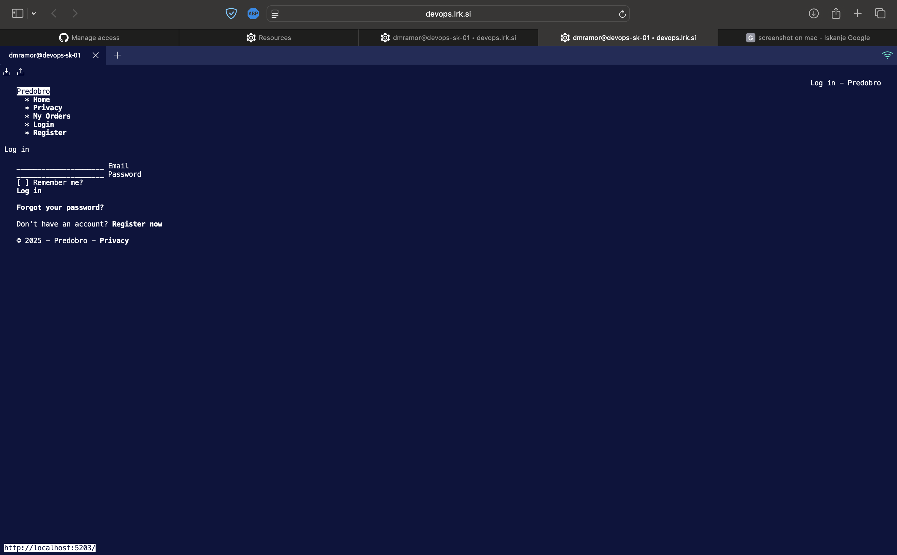

# Devops-1
Devops 1.naloga

V `Vagrantfile` se nahaja deklaracija VM, kjer si dodelimo 4Gb rama in 2CPU jedra, hkrati pa nastavimo še provision shell na `bootstrap.sh` .

V `bootstrap.sh` pa se nahaja kar nekaj zanimivih vrstic.
najprej pa **Hiter povzetek**

- **Skript zagona:** skripta se izvaja z `bash` (prva vrstica `#!/usr/bin/env bash`) in ima `set -e`, kar pomeni, da se skripta ustavi ob prvi napaki.
- **Posodobitev paketnih indeksov:** `apt-get update` osveži lokalni seznam paketov iz repozitorijev.
- **Namestitve orodij:** namesti se `git`, `docker.io`, `wget`, `sudo` in `curl`.
- **Docker konfiguracija:** `systemctl enable/start docker` zažene in omogoči docker servis; `usermod -aG docker vagrant` doda uporabnika `vagrant` v skupino `docker`.
- **.NET SDK 8:** doda se Microsoftov repozitorij in namesti `dotnet-sdk-8.0`.
- **EF orodja:** namesti se globalno orodje `dotnet-ef` za uporabnika `vagrant` in se doda pot do orodij v `/home/vagrant/.bashrc`.
- **Kloniranje repozitorija:** skripta klonira `DevopsProj` v `/home/vagrant`, če mapo še ni.
- **SQL Server (Docker):** odstrani morebiten stari kontejner `mssql2022` in zažene nov SQL Server 2022 kontejner z vnaprej nastavljenim geslom in izpostavljenim portom 1433.
- **Migracije in build:** skripta počaka, popravi povezavo v `appsettings.json`, požene EF migracije in zgradi projekt z `dotnet build`.
- **Systemd service:** ustvari `predobro.service`, ki zažene aplikacijo (`dotnet run`) na portu `5203`, nato ga omogoči in zažene.
- **Terminalni brskalnik:** namesti `links2` in doda ukaz v `.bashrc`, da ob SSH prijavi v terminalu avtomatično odpre aplikacijo na `http://localhost:5203`.

**Zanimivosti**:

**Baza geslo**

```bash
sed -i 's/Password=.*/Password=YourStrong!Passw0rd;TrustServerCertificate=true"/' \
  /home/vagrant/DevopsProj/Predobro/appsettings.json
```
Tale del kode je bilo treba implementerati, zaradi shell-a ki je imel problem z branjem tega originalnega gesla, ki se nahaja v `appsetings.json` : `Password=yourStrong(!)Password`.


**Systemd enota, ki jo skripta ustvari v `/etc/systemd/system/predobro.service`:**

```ini
[Unit]
Description=Predobro .NET App
After=network.target docker.service

[Service]
WorkingDirectory=/home/vagrant/DevopsProj/Predobro
ExecStart=/usr/bin/dotnet run --urls "http://0.0.0.0:5203"
Restart=always
RestartSec=5
User=vagrant
Environment=ASPNETCORE_ENVIRONMENT=Development

[Install]
WantedBy=multi-user.target
```

`Systemd` omogoča zagon v ozadju, avtomatski ponovni zagon, centralno beleženje (`journalctl`) in lažje upravljanje odvisnosti, zato je primernejši za produkcijsko izvajanje kot ročni `dotnet run`.


**`Bashrc` v povezavi z `links2`**

```bash
if [ -z "$SSH_TTY" ]; then
  return
fi
echo "Opening Predobro website inside terminal..."
sleep 1
links2 http://localhost:5203
```
Ta odsek skripte v `~/.bashrc` doda zgoraj naveden del kode, ki jo izvede ob prijavi preko SSH. `Bashrc` požene `links2`, ki prikazuje spletno starn `http://localhost:5203`. Grafični prikaz je viden v sliki navedeni spodaj:

